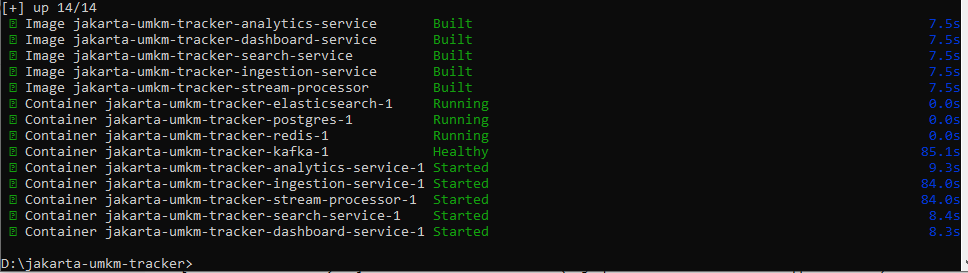
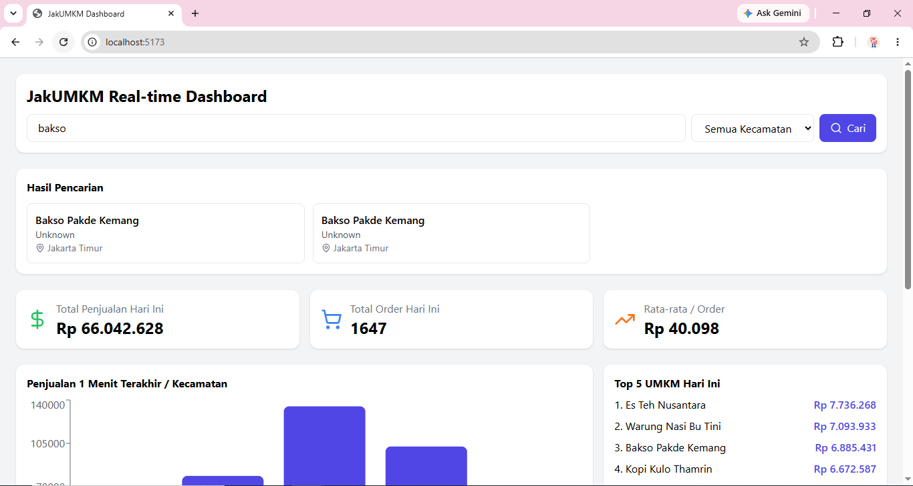
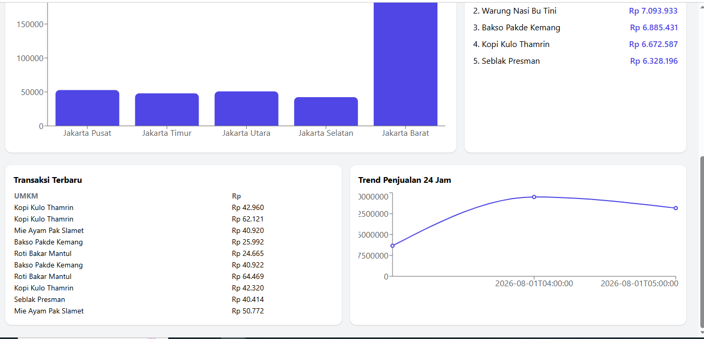
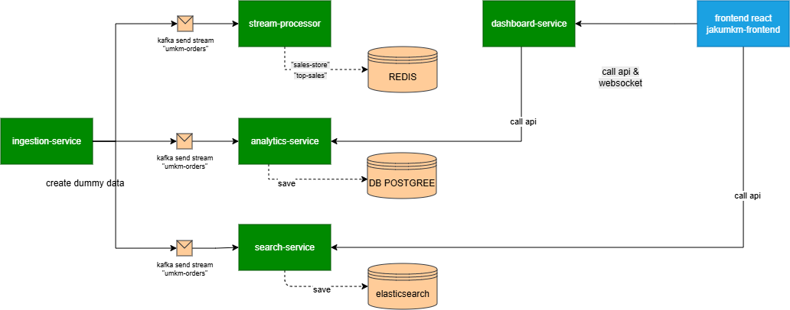

# JakUMKM Tracker

## Deskripsi

**JakUMKM Tracker** adalah aplikasi untuk menampilkan informasi mengenai pembelian produk UMKM berdasarkan wilayah di Jakarta. Aplikasi ini bertujuan membantu pengguna melihat wilayah dengan tingkat pembelian tertinggi serta melakukan pencarian data UMKM yang tersedia di Jakarta.

Aplikasi ini dapat berkembang menjadi salah satu barometer untuk menganalisis UMKM yang paling diminati dan memiliki performa penjualan terbaik di wilayah Jakarta.

---

## Teknologi yang Digunakan

* Docker
* Docker Compose
* PostgreSQL
* Apache Kafka
* Redis
* Elasticsearch

---

## Cara Menjalankan Aplikasi

### 1. Clone Repository

```bash
git clone https://github.com/asep13009/jakarta-umkm-tracker.git
```

Masuk ke direktori project:

```bash
cd jakarta-umkm-tracker
```


---

### 2. Jalankan Docker Compose

```bash
docker compose up --build -d
```

> **Catatan**
>
> Saat pertama kali dijalankan, proses build akan memerlukan waktu cukup lama karena Docker harus mengunduh seluruh image dan dependency yang dibutuhkan.

---
Output yang di harapkan :



### 3. Akses Aplikasi

Setelah seluruh container berhasil berjalan, buka browser dan akses:

```
http://localhost/
```
Output yang di harapkan :





---

## Arsitektur Sistem

Berikut adalah skema arsitektur aplikasi yang diterapkan.





---

## Fitur

* Menampilkan data pembelian UMKM berdasarkan wilayah Jakarta.
* Pencarian data UMKM.
* Integrasi dengan Elasticsearch untuk pencarian data.
* Menggunakan Kafka sebagai media streaming data.
* Redis sebagai cache.
* PostgreSQL sebagai database utama.

---

## Pengembangan Selanjutnya

Beberapa pengembangan yang direncanakan antara lain:

* Dashboard statistik yang lebih interaktif.
* Visualisasi data menggunakan grafik.
* Analisis tren pembelian berdasarkan periode waktu.
* Filtering berdasarkan kategori produk.
* API yang lebih lengkap.
* Optimasi performa pencarian menggunakan Elasticsearch.

---

## Menjalankan Ulang Aplikasi

Menjalankan container:

```bash
docker compose up -d
```

Menghentikan aplikasi:

```bash
docker compose down
```

Melihat log:

```bash
docker compose logs -f
```

Membangun ulang image:

```bash
docker compose up --build -d
```
